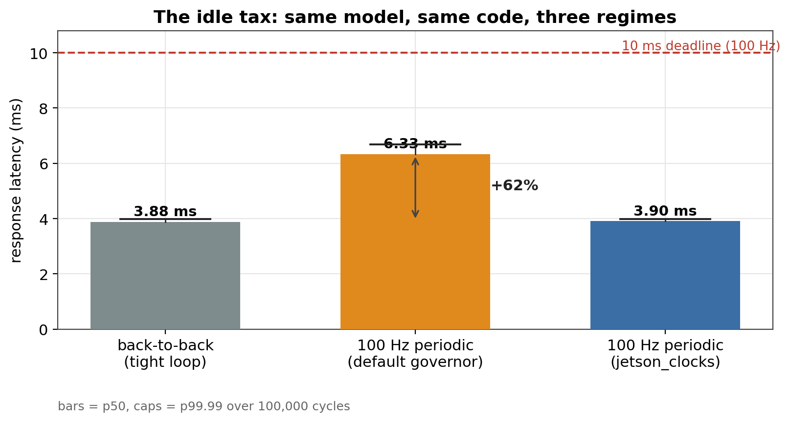
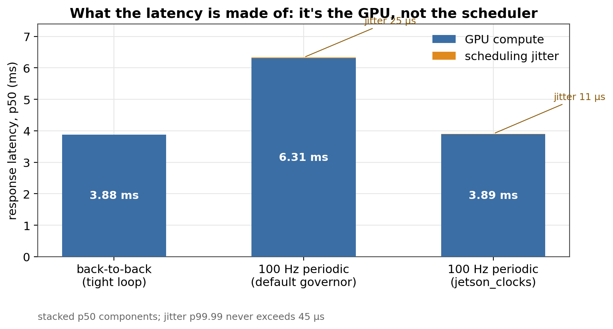
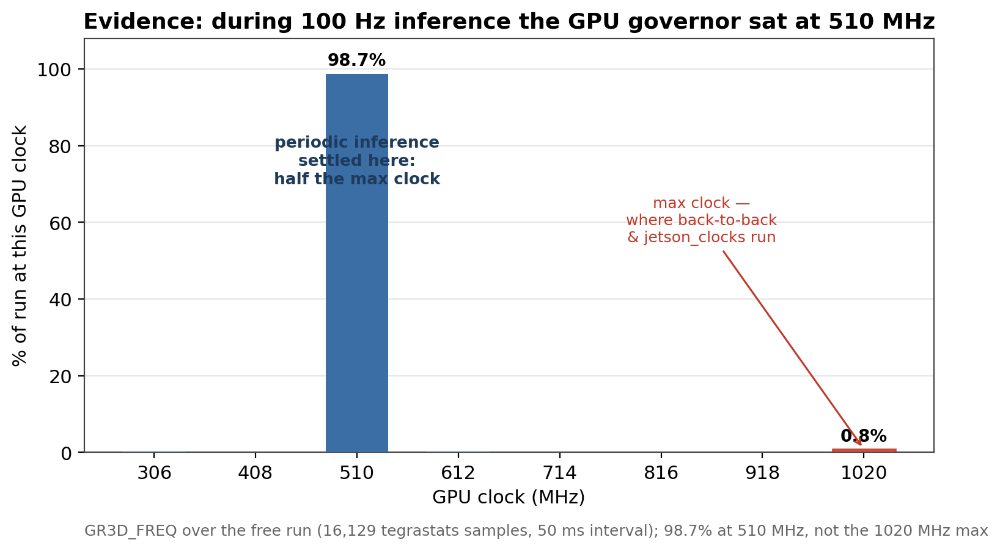
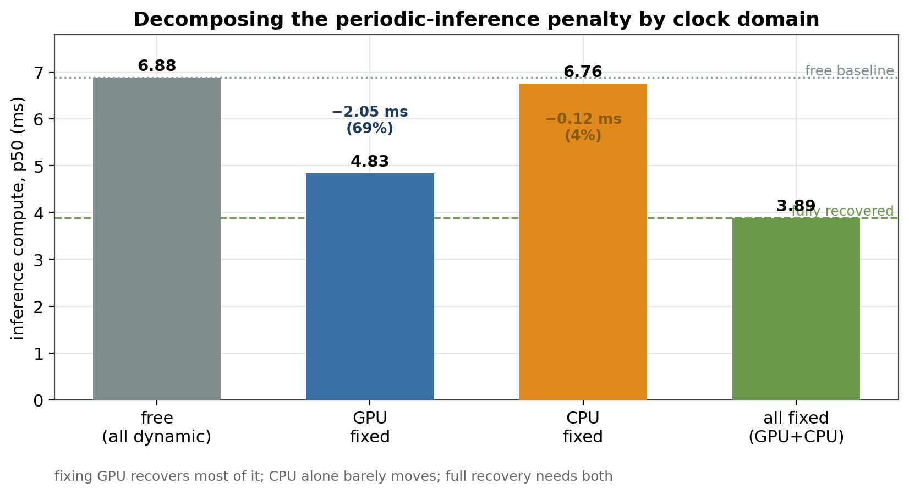
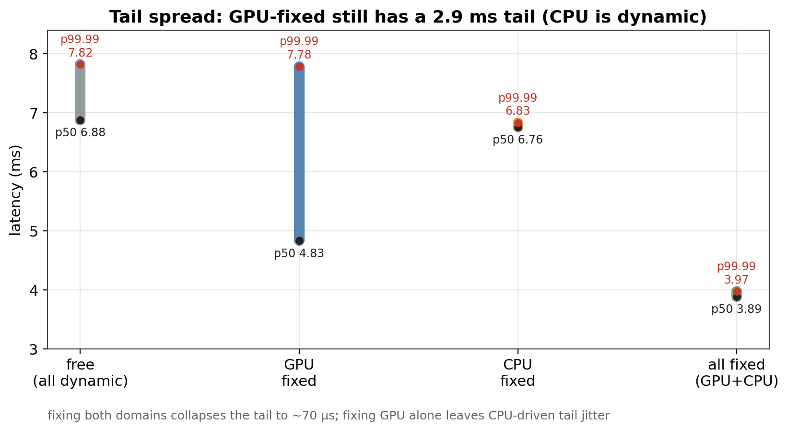
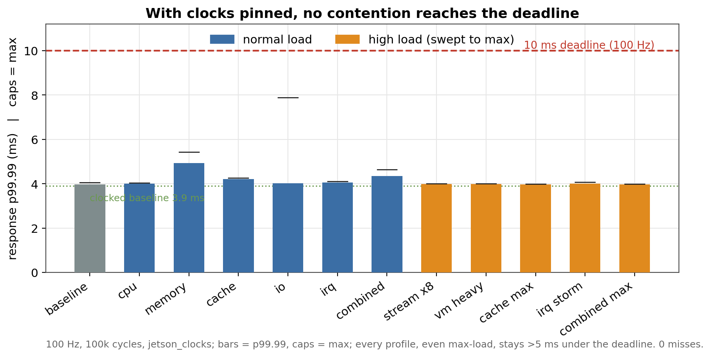
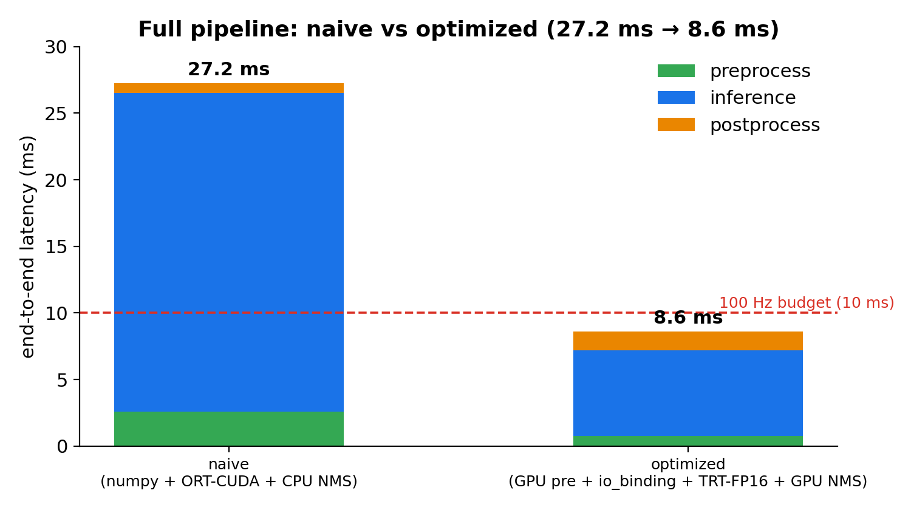
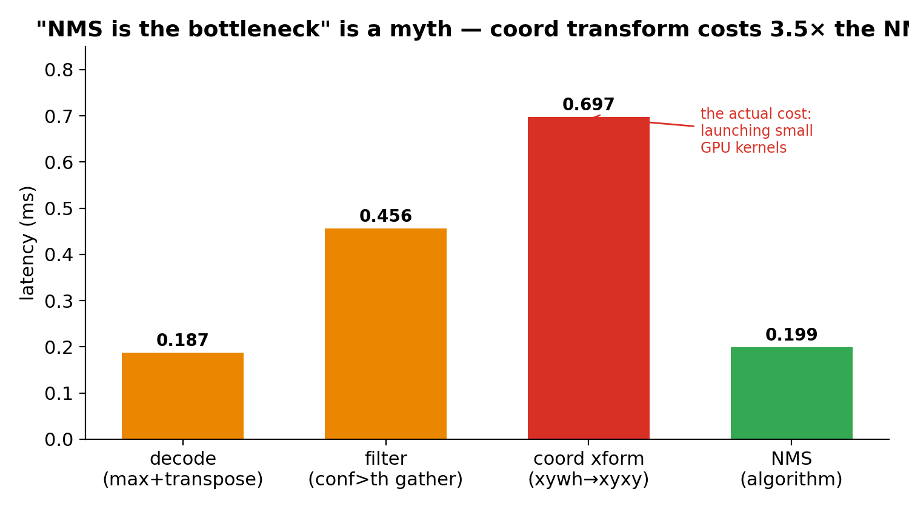

# jetson-latency-lab

**Real-time inference latency on a Jetson Orin Nano Super, measured the way it actually deploys.**

A reproducible study of periodic ML inference latency on a `PREEMPT_RT` Jetson.
Most benchmarks run inference back to back; a robot runs it on a clock. Those are
not the same measurement — and the gap is large.

---

## TL;DR

**Part 1 (published):** the same MobileNetV2 that runs back to back in 3.88 ms
runs in **6.33 ms** when driven at a real 100 Hz period — a **62%** penalty. The
per-cycle decomposition shows the cause is GPU dynamic clocking (the GPU idles
down in the ~6 ms gap between cycles), **not** the scheduler: release jitter
stays under 45 µs throughout. Locking clocks with `jetson_clocks` recovers
deterministic ~3.9 ms. Full writeup:
[cleinsoft.com/dk](https://www.cleinsoft.com/dk/posts/back-to-back-benchmarks-lie).

The harness separates three quantities per cycle, which is what makes the cause
attributable rather than guessed:

| quantity | meaning | what it blames |
|---|---|---|
| `release_jitter` | wake-up − scheduled release | scheduler / IRQ latency |
| `compute` | inference done − wake-up | GPU + framework |
| `response` | inference done − scheduled release | end-to-end, vs deadline |

**Part 2 (published):** fixing each clock domain independently shows the 62%
penalty is **GPU-dominant (~69%) but not GPU-only** — about 27% is a GPU↔CPU
pipeline interaction, and EMC plays no role. A tegrastats trace confirms the GPU
sat at 510 MHz (half its max) for 98.7% of the periodic run. The worst-case tail
needs the CPU pinned too. Writeup:
[It wasn't just the GPU](https://www.cleinsoft.com/dk/posts/it-wasnt-just-the-gpu).

**Part 3 (published):** with clocks pinned, this light loop (~6 ms slack on a
10 ms deadline) held under every `stress-ng` load tested — CPU, memory bandwidth
(STREAM ×8), cache, IO, IRQ storm, and a combined CPU+mem+cache+IO profile —
with **zero deadline misses over 100k cycles** each, staying >5 ms under the
deadline. In this regime the governor mattered more than load. Caveats: cool
server room (not thermal-tested), no competing GPU workload, single runs.
Writeup:
[What jetson_clocks survives](https://www.cleinsoft.com/dk/posts/what-jetson-clocks-survives).

**Part 4 (published) — series finale, a different model and question:** moving
from MobileNetV2 (a classifier) to **YOLOv8s** (detection, what robots actually
run), and from "why is it slow" to "where does the time go across the *whole*
pipeline." A naive full pipeline (numpy preprocess + ORT-CUDA + CPU NMS) is
**27.2 ms p50** end-to-end; optimized (TensorRT-FP16, GPU preprocess, zero-copy
`io_binding`) is **~8.9 ms p50 on real images** (~7.7 ms in the synthetic
CPU-NMS best case). The reversal: in *this implementation* the postprocess cost
wasn't NMS (0.20 ms) but the xywh→xyxy coordinate transform (0.70 ms) — small-GPU-
kernel launch overhead, not the algorithm (a fused kernel/plugin would
distribute it differently). Validated on 15 COCO images (14–135 detections;
end-to-end flat). **Note:** this part is a p50 pipeline-latency analysis, *not*
a periodic real-time validation like Parts 1–3 — no 100k-cycle loop, no p99.99,
no deadline-miss accounting on this pipeline. Writeup:
[Optimizing the whole pipeline, not just the model](https://www.cleinsoft.com/dk/posts/optimizing-the-whole-pipeline).

## Test bed

| | |
|---|---|
| Board | Jetson Orin Nano Super 8 GB |
| Power | `MAXN_SUPER` (default governor and `jetson_clocks` both measured) |
| Kernel | `PREEMPT_RT` |
| Runtime | ONNX Runtime 1.23.0, CUDA EP (PyTorch 2.9.1 / CUDA 12.6 / TensorRT 10.3.0 stack) |
| Model | MobileNetV2-12, ONNX, input `1×3×224×224` (Parts 1–3); YOLOv8s, input `1×3×640×640` (Part 4) |
| Loop | 100 Hz (10 ms period), 100k cycles, `SCHED_FIFO`, pinned to a dedicated core, `mlockall` |

Headline numbers are in [Results](#results). The 3.882 ms back-to-back figure is
the tight-loop baseline (`bench.py`); the periodic figures are this harness.

## Method

The harness ([`harness/infer_bench.py`](harness/infer_bench.py)) runs a
fixed-rate loop using absolute `clock_nanosleep(CLOCK_MONOTONIC, TIMER_ABSTIME)`
so scheduling error does not accumulate across cycles. The loop runs under
`SCHED_FIFO` pinned to a dedicated core with locked memory, so the *measurement*
is not itself a jitter source. Stressors run unpinned on the remaining cores and
contend for shared resources (cache, memory bandwidth, IRQs, the scheduler).

Stress axes are defined in
[`experiments/profiles.yaml`](experiments/profiles.yaml) and driven by
[`experiments/run_matrix.sh`](experiments/run_matrix.sh).

### Reproduce

```bash
# 0. deps
sudo apt-get install stress-ng
pip install -r requirements.txt          # numpy / matplotlib / pyyaml

# 1. isolate a core at boot (kernel cmdline), then confirm:
#    isolcpus=5 nohz_full=5 rcu_nocbs=5
cat /sys/devices/system/cpu/isolated

# 2. point the harness at your model and your inference path
#    (see harness/backends.py — wire YourBaselineBackend to your baseline code
#    so stress numbers are apples-to-apples with the baseline above)

# 3. run the full matrix (untuned), then again tuned
sudo CPU=5 MODEL=models/mobilenetv2-12.onnx ./experiments/run_matrix.sh
sudo CPU=5 MITIGATIONS=1 ./experiments/run_matrix.sh

# 4. tables + plots
python3 analysis/analyze.py     # markdown table + results/summary.csv
python3 analysis/plot.py        # tail / jitter-vs-compute / CDF PNGs
```

> Note: the baseline stack needs the documented `libcudss` `LD_LIBRARY_PATH`
> workaround in the venv activation; the harness inherits whatever env you
> launch it from.

## Results

100 Hz periodic loop, 100,000 cycles, MobileNetV2 on the CUDA EP.

| condition | resp p50 | resp p99.99 | resp max | compute p50 | jitter p99.99 | misses |
|---|---|---|---|---|---|---|
| back-to-back (tight loop) | 3.882 | 3.978 | 4.205 | — | — | 0 |
| 100 Hz periodic, default governor | 6.333 | 6.680 | 6.726 | 6306.6 | 45.0 | 0 |
| 100 Hz periodic, `jetson_clocks` | 3.905 | 3.982 | 4.017 | 3893.6 | 22.9 | 0 |

(latencies in ms except compute/jitter in µs)

Driving the same model at its real 100 Hz period costs **62%** over the
back-to-back number — and it is GPU dynamic clocking, not the scheduler
(jitter stays under 45 µs). Locking clocks with `jetson_clocks` fully recovers
deterministic ~3.9 ms.




Full writeup: [cleinsoft.com/dk](https://www.cleinsoft.com/dk/posts/back-to-back-benchmarks-lie)

### Part 2 — DVFS domain decomposition

`jetson_clocks` pins CPU+GPU+EMC together, so it cannot say *which* domain owns
the penalty. Fixing one domain at a time (100 Hz, 100k cycles), with tegrastats
logging the actual clocks:

| profile | compute p50 (ms) | recovered | share | resp p99.99 (ms) |
|---|---|---|---|---|
| free (all dynamic) | 6.881 | — | — | 7.817 |
| GPU fixed | 4.835 | 2.05 ms | ~69% | 7.784 |
| CPU fixed | 6.757 | 0.12 ms | ~4% | 6.830 |
| both fixed | 3.889 | 2.99 ms | 100% | 3.972 |

GPU-dominant but not GPU-only: ~27% is a GPU↔CPU interaction that only resolves
when both are pinned. EMC stayed at the same clock across all profiles, so it is
not the cause. Fixing the GPU recovers the *median*; the worst-case *tail* needs
the CPU pinned too. Run code in [`part2/`](part2/). Writeup:
[It wasn't just the GPU](https://www.cleinsoft.com/dk/posts/it-wasnt-just-the-gpu).





### Part 3 — stress / high-load matrix

With clocks pinned (`jetson_clocks`), drive the 100 Hz loop under contention and
push each axis harder (100 Hz, 100k cycles each):

| profile | resp p99.99 (ms) | resp max (ms) | misses |
|---|---|---|---|
| baseline (clocked) | 3.97 | 4.06 | 0 |
| memory (vm) | 4.93 | 5.43 | 0 |
| cache | 4.22 | 4.26 | 0 |
| combined (CPU+vm+timer+IO) | 4.35 | 4.65 | 0 |
| memory bandwidth ×8 (STREAM) | 3.99 | 4.01 | 0 |
| cache thrashed | 3.98 | 3.99 | 0 |
| IRQ storm | 4.01 | 4.08 | 0 |
| combined (CPU+mem+cache+IO) | 3.98 | 3.99 | 0 |

Zero misses anywhere; even the heaviest profile stays >5 ms under the 10 ms
deadline. The STREAM sweep (2→4→6→8) is flat — with the clock pinned at max,
this `stress-ng` load produced no measurable slowdown (DRAM throughput itself
wasn't measured). In this regime the governor mattered more than load. Scope is
narrow: a light model with ~6 ms slack, a cool server room (not thermal-tested),
no competing GPU workload, and single runs per profile. Run code in
[`part3/`](part3/). Writeup:
[What jetson_clocks survives](https://www.cleinsoft.com/dk/posts/what-jetson-clocks-survives).



### Part 4 — YOLOv8s full pipeline (finale)

A different model (YOLOv8s detection, input `1×3×640×640`) and a different
question: where does the time go across the whole pipeline. **This part is a p50
latency analysis, not a periodic real-time test** — warmup + a few hundred
iterations with `perf_counter`, not the 100 Hz / 100k-cycle / p99.99 / deadline-
miss harness of Parts 1–3. Naive vs optimized, end-to-end (p50, ms):

| stage | naive | optimized |
|---|---|---|
| preprocess | 2.57 (numpy) | 0.55 (GPU + upload) |
| inference | 23.98 (ORT-CUDA) | 6.34 (TensorRT-FP16 + io_binding) |
| postprocess | 0.70 | see breakdown |
| **end-to-end** | **27.25** | **~8.9 on real images** (~7.7 synthetic CPU-NMS best case) |

Backend sets the inference floor: ORT-CUDA 23.76 → TensorRT-FP16 6.34 ms (3.7×),
the last ~1 ms from zero-copy `io_binding` removing per-frame host↔device copies.
Preprocess moves to the GPU: 2.46 → 0.55 ms (4.5×).

The postprocess reversal — in *this implementation*, the named stage ("NMS")
isn't where the time goes (per-step, ms, via `postproc_microbench.py`):

| decode | filter | coord xform (xywh→xyxy) | NMS |
|---|---|---|---|
| 0.19 | 0.46 | **0.70** | 0.20 |

The coordinate transform — four small tensor ops — cost ~3.5× the NMS algorithm,
because for small tensors the GPU kernel-launch overhead dominates the work
(a fused kernel or TensorRT NMS plugin would distribute this differently; this
is about this postprocess code, not YOLO in general). NMS device choice also has
a crossover (~400 boxes): CPU faster below, GPU above; real scenes (14–135
detections) sit in CPU territory. Note `real_image_anchor.py`'s `nms` column
times coord+copy+NMS+sync as one region (~1.0 ms), not the NMS algorithm alone —
see `postproc_microbench.py` for the split.

Validated on 15 COCO val images: preprocess (0.75) and inference (6.42) are
input-independent, and end-to-end is flat (~8.9 ms p50 across the 14–135
detection range, both NMS devices). Run code in [`part4/`](part4/); per-image
p50 summaries (not per-iteration raw) in
[`results/`](results/) (`p4_real_anchor*.csv`). Scope: single model, single
stream, pre-decoded frames, cool room — no camera/ISP path, no competing GPU
workload, and no periodic-deadline tail measurement. Writeup:
[Optimizing the whole pipeline, not just the model](https://www.cleinsoft.com/dk/posts/optimizing-the-whole-pipeline).





## Layout

```
harness/
  rt_utils.py      RT primitives: abs clock_nanosleep, SCHED_FIFO, affinity, mlockall
  backends.py      pluggable inference (onnxruntime CUDA reference + baseline slot)
  infer_bench.py   periodic loop, jitter/compute/response accounting, JSON+CSV out
experiments/
  profiles.yaml    stress matrix definition
  run_matrix.sh    orchestration (stress-ng + harness, untuned/tuned)
analysis/
  analyze.py       aggregate -> markdown table + summary.csv
  plot.py          tail-by-profile, jitter-vs-compute, tail CDF
part2/
  set_domain.sh    fix one clock domain at a time (free/gpu_only/cpu_only/all)
  run_part2.sh     run each profile with tegrastats logged in parallel
  analyze_part2.py join latency with the clock/thermal trace
part3/
  run_part3.sh           stress matrix (clocked baseline + CPU/mem/cache/IO/IRQ)
  run_part3_highload.sh  high-load sweep (STREAM bandwidth, vm, cache, IRQ, all)
  analyze_part3.py       jitter-vs-compute attribution per stressor
  analyze_part3_highload.py  high-load matrix + near-miss detection
part4/
  yolo_pipeline_opt.py   naive vs optimized full pipeline, per-stage timing,
                         --boxes scene-complexity knob (synthetic NMS input)
  real_image_anchor.py   optimized pipeline on real images, real detections,
                         postprocess split into decode/filter/NMS, --nms-dev cpu|cuda
  postproc_microbench.py decode/filter/coord-transform/NMS split (reproduces the
                         "where postprocess time goes" table; documents how it
                         relates to real_image_anchor.py's fused nms column)
```

## Caveats

Single board, single model, single kernel build — this measures *this* system,
not Jetson RT in general. Numbers depend on power mode, kernel config, isolation
setup, and stress intensity, all of which are recorded in each result's
`meta` block so a run is self-describing.

## License

Apache License 2.0 — see [`LICENSE`](LICENSE) and [`NOTICE`](NOTICE). The
MobileNetV2 ONNX model is not redistributed here; fetch it from the
[ONNX Model Zoo](https://github.com/onnx/models).

---

*Built by Daniel Kang (dk). Background: ARM Linux mach #184, iriver Clix kernel +
graphics stack, now real-time ML for robots @ Cleinsoft. Writeup:
[cleinsoft.com/dk](https://cleinsoft.com/dk).*

---

## Paper

This repository backs *"Beyond CPU--GPU Frequency: Memory-Clock and Tail
Effects in Edge Inference Latency Estimation"* (Jaehoon Kang) — arXiv link TBD.

Bulk probe traces (too large for GitHub) are archived on Zenodo:
[10.5281/zenodo.20694688](https://doi.org/10.5281/zenodo.20694688).
